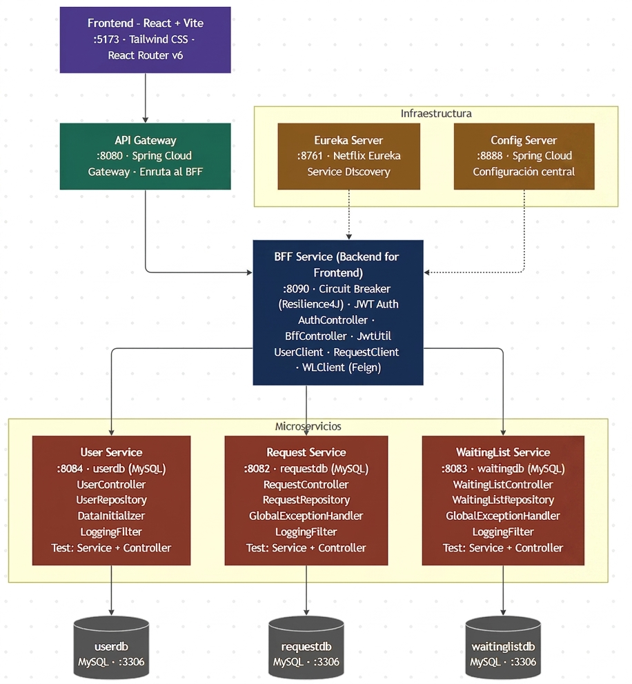

# RedNorte – Plataforma de Gestión Médica

Sistema fullstack de gestión de solicitudes médicas construido con microservicios Spring Boot y frontend React + Vite.

---

## Requisitos Previos

* Java 17 o superior
* Node.js 18 o superior y npm
* MySQL 8.0
* Maven 3.8+
* Git

---

## Arquitectura

```text
frontend/                          → React + Vite (puerto 5173)
rednorte-parent/
  infrastructure/
    eureka-server/                 → Registro de servicios (puerto 8761)
    config-server/                 → Configuración centralizada (puerto 8888)
    bff-service/                   → Backend for Frontend / Auth JWT (puerto 8090)
    api-gateway/                   → Gateway de entrada (puerto 8080)
  businessdomain/
    user-service/                  → Gestión de usuarios (puerto 8084)
    request-service/               → Gestión de solicitudes (puerto 8082)
    waiting-list-service/          → Lista de espera (puerto 8083)
```

---

## Configuración de Bases de Datos

Antes de ejecutar los microservicios, crea las bases de datos en MySQL:

```sql
CREATE DATABASE userdb;
CREATE DATABASE requestdb;
CREATE DATABASE waitinglistdb;
```

---

## Configuración del Config Server

El Config Server obtiene las propiedades de los microservicios desde un repositorio Git remoto. Asegúrate de que la propiedad `spring.cloud.config.server.git.uri` en `config-server/src/main/resources/application.properties` apunte al repositorio correcto antes de ejecutar.

---

## Orden de Ejecución

### 1. Eureka Server
```bash
cd rednorte-parent/infrastructure/eureka-server
mvn spring-boot:run
```
Disponible en: `http://localhost:8761`

### 2. Config Server
```bash
cd rednorte-parent/infrastructure/config-server
mvn spring-boot:run
```
Disponible en: `http://localhost:8888`

### 3. Microservicios de Negocio (en paralelo)
```bash
cd rednorte-parent/businessdomain/user-service
mvn spring-boot:run

cd rednorte-parent/businessdomain/request-service
mvn spring-boot:run

cd rednorte-parent/businessdomain/waiting-list-service
mvn spring-boot:run
```

### 4. BFF Service
```bash
cd rednorte-parent/infrastructure/bff-service
mvn spring-boot:run
```
Disponible en: `http://localhost:8080`

### 5. API Gateway
```bash
cd rednorte-parent/infrastructure/api-gateway
mvn spring-boot:run
```
Disponible en: `http://localhost:8090`

### 6. Frontend
```bash
cd frontend
npm install
npm run dev
```
Disponible en: `http://localhost:5173`

---

## Usuario Administrador por Defecto

Al iniciar `user-service` por primera vez, el sistema crea automáticamente un usuario administrador mediante `DataInitializer`. Usa estas credenciales para acceder al panel de administración:

| Campo    | Valor                  |
|----------|------------------------|
| Email    | `admin@rednorte.cl`    |
| Password | `admin123`             |
| Rol      | `ADMIN`                |

> Se recomienda cambiar la contraseña tras el primer inicio de sesión.

---

## Roles de Usuario

| Rol               | Descripción                                        |
|-------------------|----------------------------------------------------|
| `PACIENTE`        | Puede crear solicitudes y gestionar su perfil      |
| `MEDICO`          | Puede gestionar consultas asignadas                |
| `MEDICO_INACTIVO` | Médico deshabilitado, no recibe nuevas solicitudes |
| `ADMIN`           | Acceso completo al panel de administración         |
| `Deshabilitado`   | Usuario bloqueado, no puede iniciar sesión         |

---

## Ejecutar Tests

Cada servicio incluye pruebas unitarias ejecutables con `mvn test`. A continuación los servicios con cobertura de tests:

```bash
# Servicios de negocio
cd rednorte-parent/businessdomain/user-service
mvn test

cd rednorte-parent/businessdomain/request-service
mvn test

cd rednorte-parent/businessdomain/waiting-list-service
mvn test

# Servicios de infraestructura
cd rednorte-parent/infrastructure/bff-service
mvn test

cd rednorte-parent/infrastructure/api-gateway
mvn test

cd rednorte-parent/infrastructure/config-server
mvn test

cd rednorte-parent/infrastructure/eureka-server
mvn test
```
---
 
## Diagrama de arquitectura

